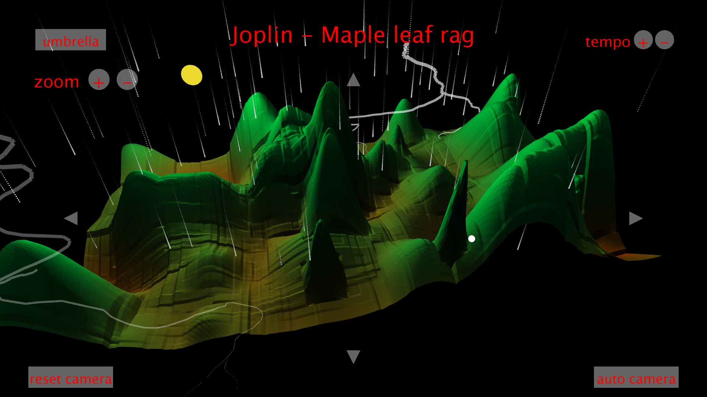

# Musiland #

Musiland is a processing project.  
It plays a midi file and each note has an impact on a 3D landscape :  
The set of notes has an global impact on the climate.  
Just like in music, a single note has an insignificant sound impact.  
Whereas a set of notes describe a sound ambiance.  

But then, do the music have a visual correspondence ?  
And if so, is a beautiful landscape a reflection of beautiful music ?  
Musiland aims to provide an overview of the answers to these questions.

[Descriptive](Musiland.pdf)  
[Demo](Musiland%20Demo.mp4)
