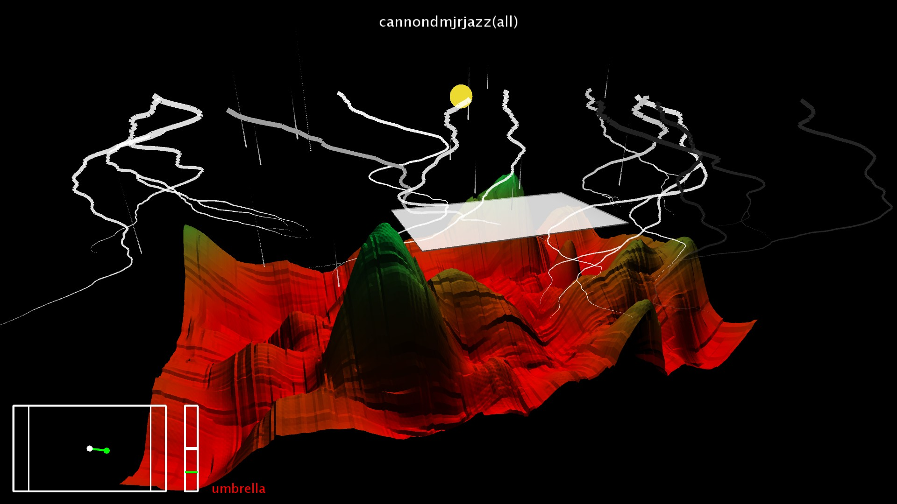

# Musiland #

Musiland is a processing project.  
It plays a midi file and each note has an impact on a 3D landscape :  
The set of notes has an global impact on the climate.  
Just like in music, a single note has an insignificant sound impact.  
Whereas a set of notes describe a sound ambiance.  

But then, do the music have a visual correspondence ?  
And if so, is a beautiful landscape a reflection of beautiful music ?  
Musiland aims to provide an overview of the answers to these questions.

[Demo](https://raw.githubusercontent.com/nicolasventer/Musiland/master/Musiland%20Demo.mp4)

## Introduction
In the land of Musiland, the landscape comes alive according to the music played.  
If no note is played the landscape seems lifeless, soulless.  
Musiland does not depend on the sound but on each melody (sequence of single notes) played.

## Description
Each note causes an impact on the landscape, rising for the high notes, descending for the low notes.  
The higher the note, the smaller and stronger the impact.  
The lower the note, the greater the impact.  
The distance between two successive impacts of the same melody is proportional to the distance between these two notes.  
The color of the ground depends on its height, green at the top, brown at the bottom.  
In addition to having an effect on the ground, music also has an effect on the climate.  
The sun rises at the beginning of the music and sets at the end of it.  
A lot of high notes make the rain fall.  
A lot of low notes make the wind blow.  
Chords (groups of simultaneous notes) make lightning fall.  
The crash of the battery make also lightning fall.

## Use
To launch the project, just choose the midi file to play, then launch the program.  
The program uses 2 controllers: the leapMotion and the mouse.  
A white dot models the position (x, y) of the hand or mouse.  
It can use the buttons of the interface.  
There are 6 buttons in total.

### Buttons
The directional arrows move the camera.  
The +/- buttons on the right of 'zoom' move the camera forward / backward.  
The +/- buttons to the right of 'tempo' increase / decrease the tempo.  
The reset camera button is used to reset the camera.  
The auto camera button enables / disables the auto camera.  
The umbrella button activates / deactivates the umbrella.

## Conclusion
A musical visualization does not have the possibility of being objective, but it does not need it.  
Indeed, it only need to be coherent in order to be understandable.  
Some choices are artistic, others are technical.  
It is up to everyone to have their own image of music.  
Musiland is a musical visualization tool, pleasant to use by its interactivity.  
Its purpose is to provide an overview of the answers to the following questions:  
How would the world be if the music gave life?  
Is a beautiful landscape the reflection of a beautiful music?
