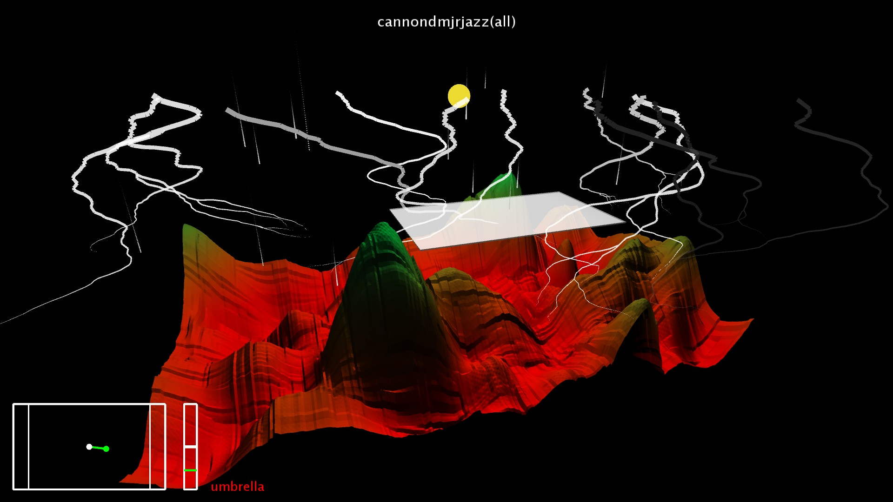

# Musiland #

This is an old version of Musiland.  
It contains modes and first person view.  
This version hasn't been kept because of the the difficulty to use it.  
Nevertheless it contains some useful code.  

[Demo](Musiland%20Demo.mp4)

## Descriptive ##

### Use 
To lauch the project, just choose the midi file to play, then launch the program.  
The program uses 2 controllers : the leapMotion and the mouse.  
As input, there are :  
the position (x,y) of the hand or the mouse,  
the state of the hand : opened or left clic, and closed or right clic,  
the height (z) of the hand or the wheel of the mouse.  
There are 8 commands in total.

### Commands 
The hand is called twisting when it's changing of state (opend/closed).  
- mode normal  
	- hand opened (x,y,z) -> umbrella  
	- hand closed (x,y,z) -> moving normal camera (from the center)  
	- hand twisting -> mode tempo  
- mode tempo  
	- hand closed (z) -> change scale tempo (from the center)  
	- hand (x) at the right -> activer camera auto normal/fpv (opened/closed)  
	- hand opened (x) � gauche -> reset camera  
	- hand closed (x) � gauche -> desactivate camera auto  
	- hand twisting -> mode fpv  
- mode fpv (first person view)  
	- hand opened (x,y,z) -> rotation camera (from the center)  
	- hand closed (x,y,z) -> move camera (from the center)  
	- hand twisting -> mode normal  